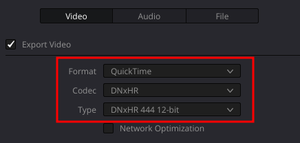
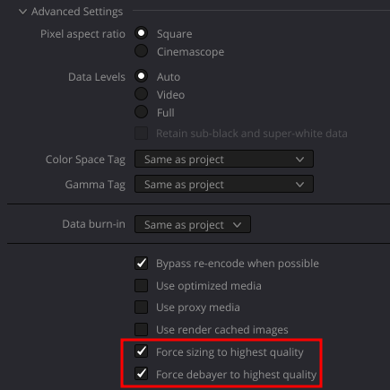
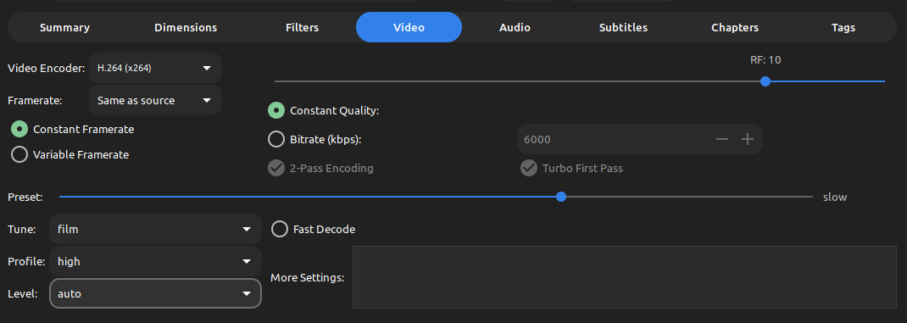
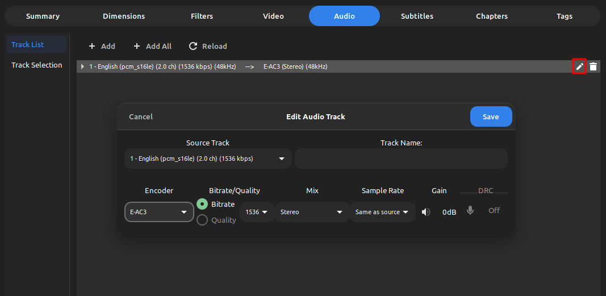

Yes, there's a reason to my madness.

Davinci Resolve sucks at regular h264/h265 encodes.
You'll notice no matter what, when you export videos in these format the videos are **blocky** and low light performance isn't ideal.

This is why I use the `DNxHR` codec, rather than a more efficient codec.
This will generate MASSIVE files.
But that's why I compress them with Handbrake and delete them after.
Which looks way better than exporting straight to h264/h265 in Resolve.

Here's my [Handbrake](https://handbrake.fr/) settings.

Now I'm no video encoding expert.
These are not the most efficent settings.
But they are fast and most widely supported across devices.
They also work great for video archival, and give me enough data to work with so that I can recompress the video later on if needed.

I also recommend perserving the audio quality.

This assumes that your source audio is lossless. 
Now when you recompress your files you don't sacrifice audio quality.
